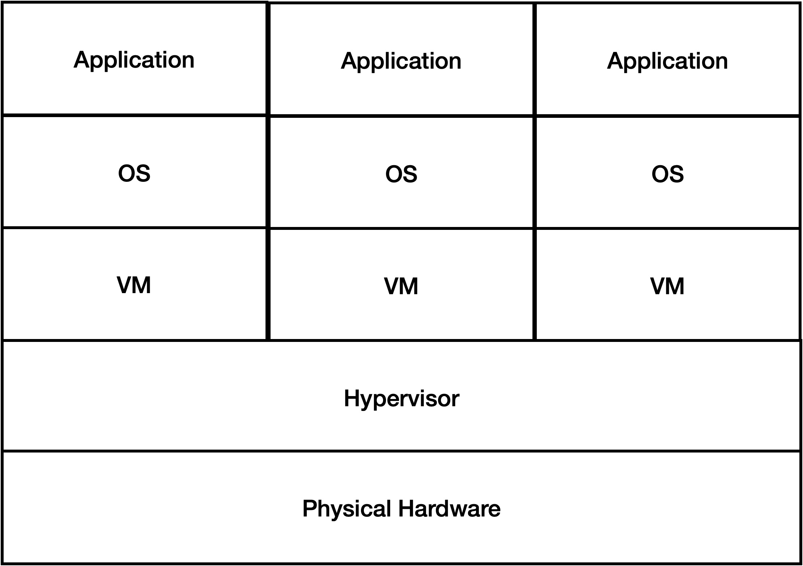
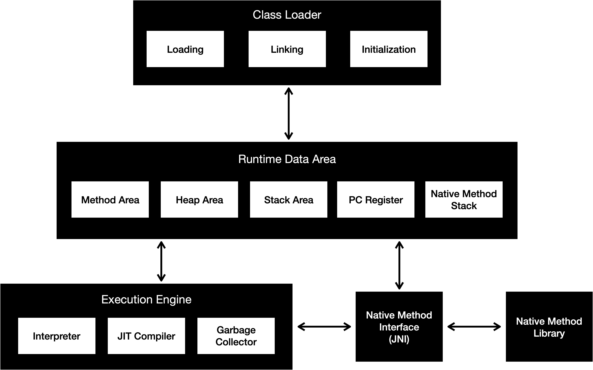
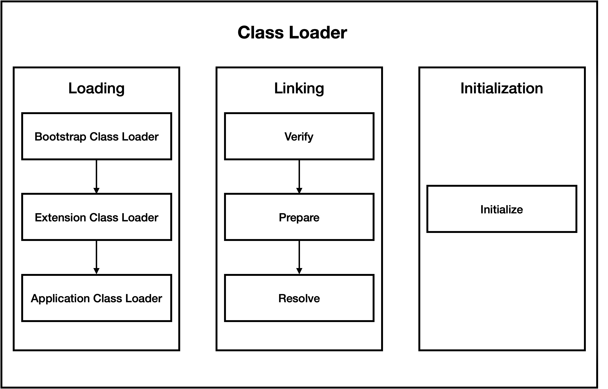
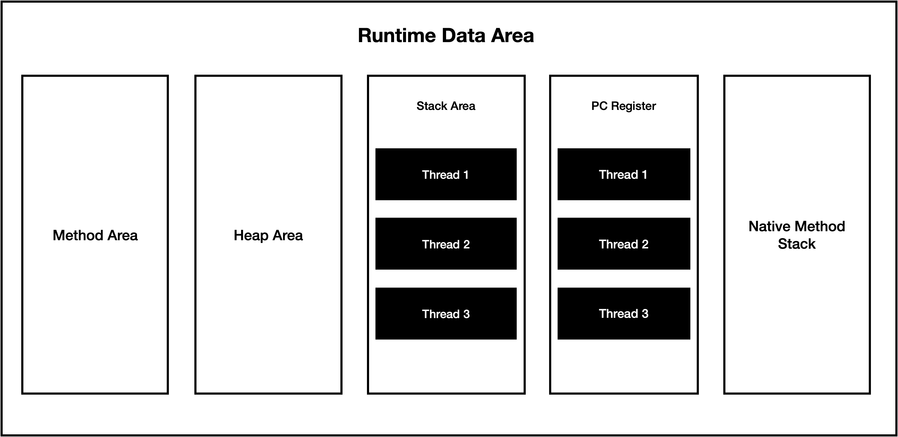
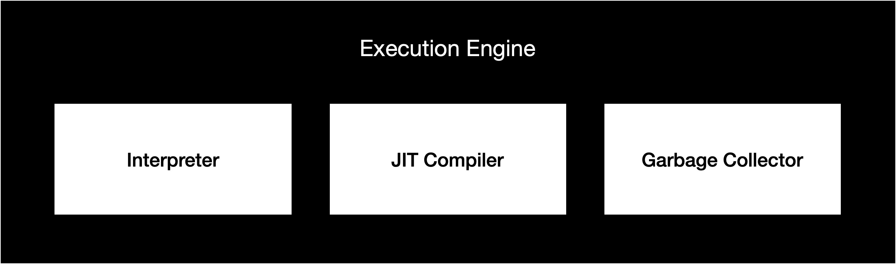
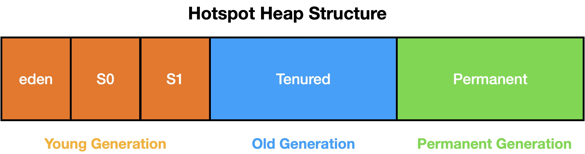

&ensp;JVM(Java Virtual Machine)은 피지컬 머신에서 자바 코드를 컴파일하고 실행하기 위한 필수 요소라 할 수 있다.
초기의 JVM은 Java 플랫폼만을 지원하도록 설계 되었지만, 현재는 Kotlin, Groovy, Scala와 같은 다양한 언어를 지원하고 있다. 이렇게 JVM이 지원하는 언어들을 통틀어 JVM languages라고도 한다.


# JVM (Java Virtual Machine)

&ensp;JVM이라는 이름에서 알 수 있 듯, JVM을 `가상 머신(Virtual Machine)`이라 부른다. 그렇다면 가상머신이란 무엇일까?



&ensp;가상머신은 하나의 물리적인 하드웨어 위에서 격리되어 구동되는 가상 환경이라 할 수 있다. 하나의 가상머신은 하이퍼바이저라는 소프트웨어가 설치된 하나의 호스트 머신 위에서 각각 CPU, 메모리, 스토리지, 네트워크 인터페이스를 갖추고 있다. 이러한 `System Virtual Machine`은 각각 격리된 환경에서 OS가 제공하는 대부분의 기능들을 제공한다.

&ensp;JVM은 OS로부터 메모리 공간을 할당 받아 해당 메모리를 자체적으로 관리하며, 독립적인 런타임 환경에서 Java 클래스 파일을 실행하는 `Process Virtual Machine`이다.

<br/>

---

# JVM의 구성요소

&ensp;컴파일 이후 JVM이 Java Application을 실행하는 큰 흐름은 다음과 같다.

> (1) 컴파일 된 class 파일을 `Class Loader`가 `Runtime Data Area`에 로드한다. \
> (2) 적재한 바이트코드를 `Execution Engine`이 실행한다. \
> (3) 실행 도 중 Heap 영역에서 더 이상 참조되지 않는 objects 들을 `Garbage Collector` 가 정리한다.

&ensp;생략된 것이 많은 매우 간략한 내용이지만, 애플리케이션이 실행된 이후 종료되기까지, \
`Class Loader`, `Runtime Data Area`, `Execution Engine`, `Garbage Collector` 와 같은 JVM 주요 컴포넌트들이 이런 유기적인 상호작용을 하며 동작한다. (`Garbage Collector`는 실행엔진 영역의 컴포넌트이지만, 중요도가 높아서 별도로 표기하였다.)

&ensp;JVM의 핵심 컴포넌트들은 다음과 같은 구조를 이룬다.



&ensp;JVM을 구성하는 핵심 컴포넌트들을 정확하게 이해하는 것이 곧 JVM을 이해하는 것이라 할 수 있다. \
이제부터 각 컴포넌트들을 하나씩 살펴보자.

<br/>

---

<br/>

## Class Loader

&ensp;클래스 로더는 컴파일 된 바이트 코드(`.class` files)들을 `Runtime Data Area` 에 로드한다. \
여기서 주의해야 할 것은, 모든 클래스 파일들을 이 시점에 로드하는 것이 아니라는 점이다. JVM의 기본 클래스 로딩 방식은 Lazy loading이다. `main()` 메소드가 위치한 클래스를 로드하고, 실행엔진으로 바이트 코드를 해석하며, 필요할 때 마다 각 클래스를 메인 메모리에 적재하고 읽어들인다.

&ensp;클래스 로더의 세부 구성을 살펴보면 다음과 같다.



&ensp;클래스 로더의 동작 메커니즘은 크게 `Loading`, `Linking`, `Initialization`  세 단계의 절차로 수행된다. \
각 과정들을 하나씩 살펴보자.

<br/>

### Loading
&ensp;클래스 로더가 바이트 코드를 JVM에 로드하는 과정이다.`java.lang`, `java.util` 같은 Java의 스탠다드 패키지부터 라이브러리까지 각 바이트 코드마다 담당하는 클래스 로더가 다르다. 내부적으로 JVM이 `ClassLoader.loadClass()` 를 실행하여 메모리에 바이트 코드를 적재한다. 

&ensp;Class Loader의 세부적인 계층 구성은 다음과 같다. 

[Class Loader 계층 구성 이미지]

- **Boostrap Class Loader** : 모든 클래스 로더의 루트 레벨로써, `rt.jar`  파일에 위치하는 Java의 스탠다드 패키지들과 `$JAVA_HOME/jre/lib` 에 있는 코어 라이브러리들을 로드한다.
- **Extention Class Loader :** `$JAVA_HOME/jre/lib/ext` 에 위치하는 extension Java 라이브러리들을 로드한다.
- **Application Class Loader** : `classpath` 에 위치한 클래스들을 찾아서 로드한다. 즉, 라이브러리가 아닌 개발자가 작성한 소스파일로부터 생성된 바이트 코드들을 JVM에 적재한다.

&ensp;클래스 로더는 상위 로더부터 클래스를 하나씩 찾아간다. 최하단에 있는 클래스 로더까지 해당되는 클래스 파일을 찾지 못하면 `ClassNotFoundException` 예외가 발생한다. 

<br/>

### Linking
&ensp;`Linking`은 클래스 파일이 메모리에 적재 된 이후 의존하는 클래스 파일들을 서로 연결(Link)하고 검증하는 과정이다.
- **Verification** : 클래스 파일의 유효성을 검증한다. 유효하지 않은 클래스 파일인 경우 `VerifyException` 이 발생한다.
- **Preparation** : 유효성 검증을 통과한 클래스 파일들에 대하여 static 필드 및 클래스를 기본 값과 함께 초기화한다.
- **Resolution** : Symbolic Reference 값들을 클래스, 상수, 메소드 등 Runtime Constant Pool에 있는 실제 메모리 참조 값(Actual Reference)으로 대체한다.

<br/>

### **Initialization**

&ensp;constructor, static block 실행 등 초기화 과정이 수행된다. 클래스 로딩의 마지막 과정이라 할 수 있다. JVM은 멀티 쓰레드 환경에서 구동되기 때문에 Initialization 과정에서도 동시성 이슈가 발생할 여지가 있으므로 주의 해야한다.

<br/>

---

<br/>

## Runtime Data Area

&ensp;앞서 살펴본 것과 같이 클래스 파일들은 Class Loader에 의해 Runtime Data Area에 적재 된다. Runtime Data Area는 5개 영역으로 나뉘어져 있는데, 애플리케이션 실행 도 중 데이터의 타입에 따라 `Method Area`, `Heap Area`, `Stack Area`, `PC Register`, `Native Method Stack` 영역에 저장되고 참조된다.



<br/>

### Method Area

&ensp;실행 시점에 사용되는 Constant Pool, field, method, constructors 같은 데이터들이 위치한다. 만약 가용 공간이 부족하다면 `OutOfMemorryError` 가 발생한다. JVM 당 하나의 `Method Area` 를 가진다.

<br/>

### Heap Area

&ensp;객체 및 인스턴스 변수, 배열 등과 같은 타입의 값들이 위치한다.

```java
Example example = new Example();
```

&ensp;예를 들어 위와 같은 코드를 동작 시키면 `Example` 인스턴스를 생성한 뒤 Heap Area에 배치한다. 메소드 영역과 마찬가지로 힙 영역 역시 JVM 당 하나의 공간만을 갖게 된다.

<br/>

### Stack Area

&ensp;특정 메소드가 호출 되고 실행되면서 사용되는 지역 변수(Local Variables), 중간 연산 결과(Operand Stack) 값이 갱신되며 저장되는 영역이다. 메소드 호출 시점마다 `Stack Frame`이라는 하나의 단위가 스택에 생성되고, 해당 메소드가 종료되는 시점에 파괴된다.

&ensp;스택 영역은 JVM에 의해 쓰레드가 생성될 때 마다 각 쓰레드에 하나씩 할당된다. 따라서 동시성 문제로부터 자유롭다.

<br/>

### Program Counter (PC) Registers

&ensp;현재 실행되고 있는 명령어의 주소 값이 저장되는 공간이다. PC Register는 현재 실행하고 있는 명령어의 실행이 끝나면 다음 명령어의 주소 값을 갱신한다. 각 쓰레드 마다 하나의 PC Register가 할당된다.

<br/>

### Native Method Stacks

&ensp;Java가 아닌 C, C++과 같은 언어로 작성 된 메소드(Native Method) 실행을 지원하는 영역. 스택 영역과 같이 각 쓰레드마다 하나의 공간이 할당된다.

<br/>

---

<br/>

## Execution Engine



&ensp;Runtime Data Area에 각 바이트코드가 로드되면 `Execution Engine`이 이들을 실행하는데, Java compiler에 의해 생성된 클래스 파일들은 머신이 읽을 수 있는 기계어가 아닌 바이트 코드이다. 따라서 이를 한번 더 변환하는 과정이 필요하다.

&ensp;JVM은 효율성을 위해 두 가지 방법을 혼합하여 이를 실현한다. 기본 전략으로는 JavaScript, Python와 같은 언어 처럼 `Interpreter`가 한 라인씩 바이트 코드를 해석하는 방식을 사용하고, 만약 반복되는 바이트 코드가 발견되면 `JIT Compiler` 를 통해 이들을 한번에 변환하기도 한다.

<br/>

### Interpreter

&ensp;바이트 코드를 한 줄씩 읽고 실행한다. 매 라인마다 이러한 동작을 반복하기 때문에, 코드 구성에 따라 통으로 컴파일하는 방식 보다 느릴 수 있다.

   아래처럼 값을 누적하는 코드와 같이, 같은 메소드의 반복이 자주 등장하는 코드의 경우 이를 통으로 변환하는 것이 더 유리할 수 있다.

```java
int total = 0;
for(int i = 0 ; i <= 10; i++) {
   total += i;
}
```

<br/>

### JIT Compiler

&ensp;앞서 설명한 것과 같이, 반복되는 코드가 빈번한 경우, 인터프리터 방식이 성능상 비효율적일 수 있다. 실행 엔진은 `JIT Compiler` 를 통해 이를 해결한다.
JIT Compiler의 구성요소인 `Profiler`를 통해 반복되는 코드(hotspot)를 발견하면 JIT Compiler는 이를 네이티브 머신 코드로 한번에 컴파일한다. 변환된 코드는 시스템에 의해 한번에 읽히게 되므로 성능이 향상된다.

<br/>

---

<br/>

## Garbage Collector



&ensp;`Garbage Collector` 는 Heap Area에 로드 되었지만 현재는 참조 되고 있지 않는 오브젝트들을 찾아서 지우고 사용되지 않는 메모리 공간을 다시 회수한다.

   이는 다음의 두 과정을 거친다.
1. **Mark** : GC가 참조되지 않는 오브젝트들을 찾아서 mark한다.
2. **Sweep** : GC가 mark 된 오브젝트들을 힙 메모리로부터 정리한다.

GC는 JVM에 의해 텀을 두고 자동으로 동작한다. `System.gc()` 를 통해 명시적으로 호출하는 방법도 있지만 이는 즉시 동작을 보장하진 않는다. 또한 JVM은 GC를 수행할 때, 이를 실행하는 쓰레드 이외에는 작업을 중단(`Stop The World`)하게 되므로 명시적인 호출은 지양해야 한다.

(GC는 그 자체로 다루어야 할 주제가 굉장히 많다고 생각한다. 추후 별도의 학습 포스트로 다뤄 볼 예정이므로, 이번 포스트에서는 
대표적인 몇 가지 GC만 가볍게 살펴보고 넘어가려 한다.)

<br/>

### Serial GC

&ensp;싱글 쓰레드 환경의 작은 애플리케이션에서 동작하는 가장 단순한 방식의 GC 구현체이다. 싱글 쓰레드 환경에만 적합한 GC이기 때문에 GC가 동작할 때 애플리케이션 전체가 중지(`Stop The World`) 된다.

<br/>

### Parallel GC

&ensp;JVM의 Java 8의 default GC 구현체이며, 다중 쓰레드 환경을 지원한다. `Serial GC` 보다 빠른 퍼포먼스를 보여준다.

<br/>

### Garbage First GC (G1 GC)

&ensp;멀티 프로세스 환경을 지원하기 위해 개발 된 GC 구현체이며, 대용량 메모리 운용이 가능하다. `Stop The World` 시간을 최소화 하였지만, 이를 완전 해결하지는 못했다. Java 9부터 default GC 구현체이다.

<br/>

---

<br/>

## Java Native Interface (JNI)

&ensp;앞서 `Runtime Data Area`의 `Native Method Stacks`를 다루며 `Native Code`에 대해 간단히 언급했었다.
  JNI 역시 Java가 아닌 네이티브 코드를 사용하여 OS 혹은 하드웨어를 컨트롤하는 소프트웨어 또는 라이브러리의 사용을 가능하게 한다.

<br/>

---

<br/>
<br/>
<br/>

### References:
[https://www.infoworld.com/article/3272244/what-is-the-jvm-introducing-the-java-virtual-machine.html](https://www.infoworld.com/article/3272244/what-is-the-jvm-introducing-the-java-virtual-machine.html)
[https://en.wikipedia.org/wiki/Java_virtual_machine](https://en.wikipedia.org/wiki/Java_virtual_machine)
[https://www.freecodecamp.org/news/jvm-tutorial-java-virtual-machine-architecture-explained-for-beginners/](https://www.freecodecamp.org/news/jvm-tutorial-java-virtual-machine-architecture-explained-for-beginners/)
[https://www.redhat.com/ko/topics/virtualization/what-is-a-hypervisor](https://www.redhat.com/ko/topics/virtualization/what-is-a-hypervisor)
[https://www.redhat.com/ko/topics/virtualization/what-is-a-virtual-machine](https://www.redhat.com/ko/topics/virtualization/what-is-a-virtual-machine)